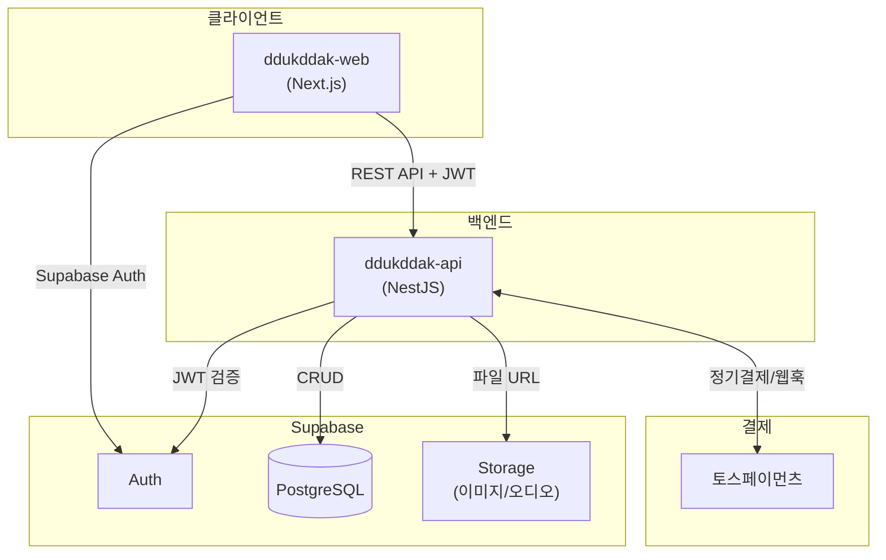
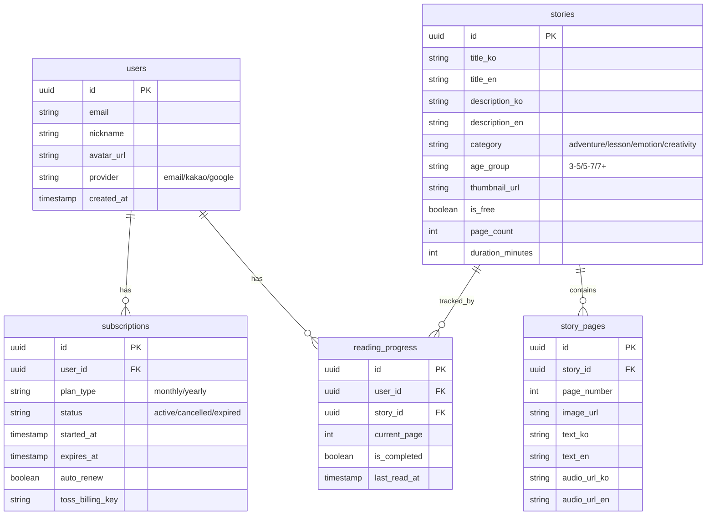

# 뚝딱동화 백엔드 - ddukddak-api

> NestJS 기반 백엔드 API 서버

---

## 🤖 Claude 역할

- **이름**: 코난 (백엔드 개발 전문가)
- **담당**: 백엔드 프로젝트 개발 및 관리
- **문서 관리**: 이 프로젝트 내 문서만 (`ddukddak-api/`)
- **외부 문서**: 수정 필요 시 사용자 허락 후 수행

---

## 프로젝트 개요

| 항목 | 내용 |
|------|------|
| **서비스명** | 뚝딱동화 (Ddukddak Tale) |
| **프로젝트** | 백엔드 API 서버 |
| **프레임워크** | NestJS 11.0.1 |
| **패키지 매니저** | pnpm |
| **Node 버전** | 20+ |
| **API Base URL** | `http://localhost:4000/api` (개발) |

---

## 기술 스택

| 영역 | 기술 | 비고 |
|------|------|------|
| Framework | NestJS 11.x | TypeScript |
| Database | PostgreSQL 15.x | Supabase 호스팅 |
| Auth | Supabase Auth | JWT 검증 |
| Storage | Supabase Storage | 이미지, 오디오 파일 |
| 결제 | 토스페이먼츠 | 정기결제 (빌링키) |
| API 문서 | Swagger | 자동 생성 |
| 배포 | Cloud Run | Docker 컨테이너 |

---

## 시스템 아키텍처



---

## 프로젝트 구조 (목표)

```
src/
├── main.ts
├── app.module.ts
├── common/                 # 공통 모듈
│   ├── decorators/         # @CurrentUser 등
│   ├── filters/            # 예외 필터
│   ├── guards/             # JwtAuthGuard, SubscriptionGuard
│   ├── interceptors/       # 응답 변환
│   └── pipes/              # 유효성 검사
├── config/                 # 환경설정
│   ├── config.module.ts
│   └── configuration.ts
├── supabase/               # Supabase 클라이언트
│   ├── supabase.module.ts
│   └── supabase.service.ts
├── user/                   # 사용자 모듈
│   ├── user.module.ts
│   ├── user.controller.ts
│   ├── user.service.ts
│   └── dto/
├── story/                  # 동화 모듈
│   ├── story.module.ts
│   ├── story.controller.ts
│   ├── story.service.ts
│   └── dto/
├── progress/               # 진행률 모듈
│   ├── progress.module.ts
│   ├── progress.controller.ts
│   ├── progress.service.ts
│   └── dto/
├── subscription/           # 구독 모듈
│   ├── subscription.module.ts
│   ├── subscription.controller.ts
│   ├── subscription.service.ts
│   ├── toss.service.ts     # 토스페이먼츠 연동
│   └── dto/
└── webhook/                # 웹훅 모듈
    ├── webhook.module.ts
    └── webhook.controller.ts
```

---

## API 엔드포인트

> 상세 명세: `docs/API_SPEC.md` (프론트엔드 연동용)

### 사용자 (User)
| 메서드 | 엔드포인트 | 설명 | 인증 |
|--------|-----------|------|------|
| GET | `/api/users/me` | 내 프로필 조회 | 🔒 |
| PATCH | `/api/users/me` | 프로필 수정 | 🔒 |
| DELETE | `/api/users/me` | 회원 탈퇴 | 🔒 |

### 동화 (Story)
| 메서드 | 엔드포인트 | 설명 | 인증 |
|--------|-----------|------|------|
| GET | `/api/stories` | 동화 목록 (필터, 페이지네이션) | 🔓 |
| GET | `/api/stories/:id` | 동화 상세 | 🔓 |
| GET | `/api/stories/:id/pages` | 동화 페이지 (뷰어용) | 💎 |

### 진행률 (Progress)
| 메서드 | 엔드포인트 | 설명 | 인증 |
|--------|-----------|------|------|
| GET | `/api/progress` | 내 진행률 목록 | 🔒 |
| GET | `/api/progress/:storyId` | 특정 동화 진행률 | 🔒 |
| PUT | `/api/progress/:storyId` | 진행률 저장 | 🔒 |

### 구독 (Subscription)
| 메서드 | 엔드포인트 | 설명 | 인증 |
|--------|-----------|------|------|
| GET | `/api/subscriptions/plans` | 구독 플랜 목록 | 🔓 |
| GET | `/api/subscriptions/me` | 내 구독 정보 | 🔒 |
| POST | `/api/subscriptions` | 구독 시작 (결제) | 🔒 |
| DELETE | `/api/subscriptions/me` | 구독 해지 | 🔒 |
| GET | `/api/subscriptions/payments` | 결제 내역 | 🔒 |

### 웹훅 (Webhook)
| 메서드 | 엔드포인트 | 설명 | 인증 |
|--------|-----------|------|------|
| POST | `/api/webhooks/toss` | 토스페이먼츠 웹훅 | 🔐 |

**인증 구분**: 🔓 공개 | 🔒 로그인 필요 | 💎 구독 필요 | 🔐 내부용 (시크릿 키)

---

## DB ERD (Supabase PostgreSQL)



---

## 환경 변수

```env
# Server
PORT=3000
NODE_ENV=development

# Supabase
SUPABASE_URL=https://xxx.supabase.co
SUPABASE_ANON_KEY=xxx
SUPABASE_SERVICE_ROLE_KEY=xxx

# 토스페이먼츠
TOSS_SECRET_KEY=test_sk_xxx
TOSS_WEBHOOK_SECRET=xxx

# CORS
CORS_ORIGIN=http://localhost:3000
```

---

## 개발 명령어

```bash
pnpm install          # 의존성 설치
pnpm run start:dev    # 개발 서버 (watch mode)
pnpm run build        # 빌드
pnpm run start:prod   # 프로덕션 실행
pnpm run lint         # 린트
pnpm run test         # 유닛 테스트
pnpm run test:e2e     # E2E 테스트
```

---

## 기획 문서 참조

| 문서 | 경로 | 용도 |
|------|------|------|
| API 명세 | `../fairytale-planning/docs/5_API_SPEC.md` | 엔드포인트 상세 |
| 기술 스택 | `../fairytale-planning/docs/4_TECH_STACK.md` | 아키텍처, 배포 |
| 개발 계획 | `../fairytale-planning/docs/6_DEV_PLAN.md` | Phase 2 작업 |
| 작업 현황 | `../fairytale-planning/docs/7_TASK_TRACKER.md` | 전체 진행률 |

---

## 프론트엔드 연동 정보

| 항목 | 내용 |
|------|------|
| 프로젝트 | `../ddukddak-web/` |
| 프레임워크 | Next.js 16 + TypeScript |
| 상태 | Phase 1 완료 (13개 화면 UI, Mock 데이터) |
| Auth | Supabase Auth (프론트에서 직접 연동) |
| API 호출 | axios + TanStack Query |

**백엔드 역할**: Supabase JWT 토큰 검증 → 사용자 정보 추출 → API 응답

---

## Phase 2 작업 현황

### 진행률: 2/7 (28%)

```
✅ 2-1. 프로젝트 세팅      [████████  ] 85%
✅ 2-2. 사용자 API         [██████████] 100%
⬜ 2-3. 동화 API           [          ] 0%
⬜ 2-4. 진행률 API         [          ] 0%
⬜ 2-5. 구독/결제 API      [          ] 0%
⬜ 2-6. 프론트 API 연동    [          ] 0%
⬜ 2-7. 배포               [          ] 0%
```

### 작업 상세

| # | 작업 | 상태 | 완료 항목 |
|---|------|------|----------|
| 2-1 | 프로젝트 세팅 | 🔄 진행 중 | |
| | - 필수 패키지 설치 | ✅ | @nestjs/config, @supabase/supabase-js, class-validator, class-transformer, @nestjs/swagger |
| | - 환경 변수 설정 | ✅ | ConfigModule, .env.example |
| | - Supabase 클라이언트 | ✅ | SupabaseModule, SupabaseService |
| | - JWT Guard 설정 | ✅ | JwtAuthGuard, @Public, @CurrentUser |
| | - Swagger 설정 | ✅ | /docs 엔드포인트 |
| | - 공통 모듈 구조 | ✅ | decorators, guards |
| | - Docker 설정 | ⬜ | |
| 2-2 | 사용자 API | ✅ 완료 | |
| | - GET /api/users/me | ✅ | 프로필 조회 |
| | - PATCH /api/users/me | ✅ | 프로필 수정 |
| | - DELETE /api/users/me | ✅ | 회원 탈퇴 |
| 2-3 | 동화 API | ⬜ 대기 | |
| | - GET /api/stories | ⬜ | |
| | - GET /api/stories/:id | ⬜ | |
| | - GET /api/stories/:id/pages | ⬜ | |
| 2-4 | 진행률 API | ⬜ 대기 | |
| | - GET /api/progress | ⬜ | |
| | - GET/PUT /api/progress/:storyId | ⬜ | |
| 2-5 | 구독/결제 API | ⬜ 대기 | |
| | - 구독 플랜/정보 조회 | ⬜ | |
| | - 구독 시작/해지 | ⬜ | |
| | - 토스페이먼츠 연동 | ⬜ | |
| | - 웹훅 처리 | ⬜ | |
| 2-6 | 프론트 API 연동 | ⬜ 대기 | |
| 2-7 | 배포 | ⬜ 대기 | |

---

## 설정 현황

- [x] NestJS 11.0.1 프로젝트 생성
- [x] TypeScript strict mode
- [x] ESLint + Prettier 설정
- [x] Git 저장소 연동
- [x] 필수 패키지 설치
- [x] 환경 변수 설정 (ConfigModule)
- [x] Supabase 클라이언트 모듈
- [x] JWT Guard 설정
- [x] Swagger 설정
- [x] 공통 모듈 구조 (decorators, guards)
- [ ] Docker 설정
- [ ] CI/CD 설정

---

## 관련 프로젝트

```
fairytale/
├── fairytale-planning/    # 기획 문서 (100% 완료)
├── ddukddak-web/          # 프론트엔드 - Phase 1 완료 ✅
└── ddukddak-api/          # 백엔드 ← 현재 (Phase 2 진행 중)
```

---

*마지막 업데이트: 2026-01-25*
