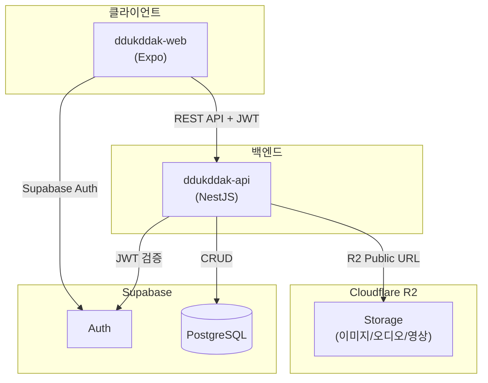
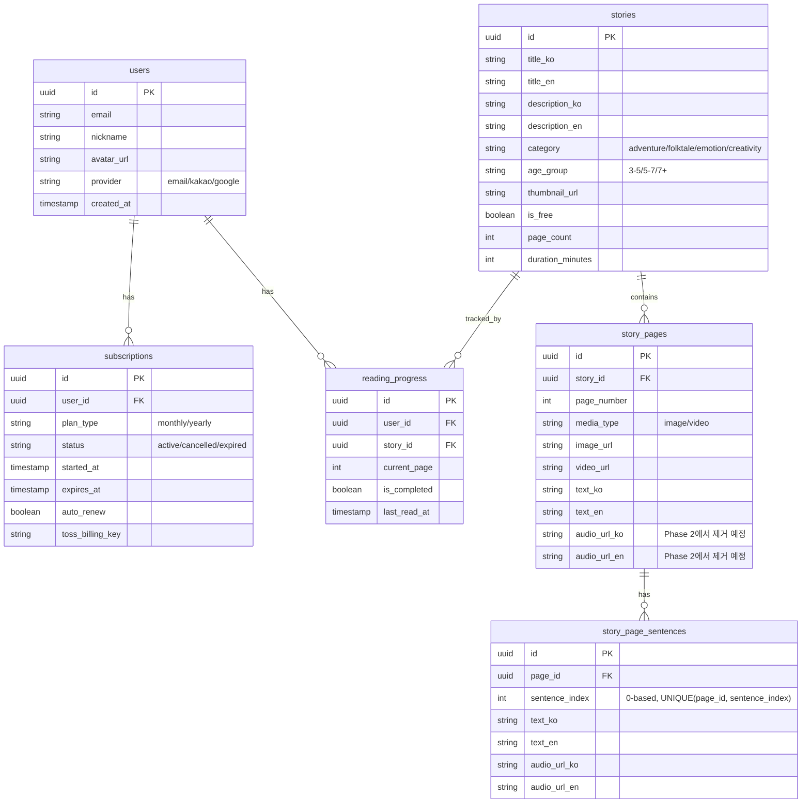

# 뚝딱동화 백엔드 - ddukddak-api

> NestJS 기반 백엔드 API 서버

---

## 🤖 Claude 역할

- **이름**: 코난 (백엔드 개발 전문가)
- **담당**: 백엔드 프로젝트 개발 및 관리
- **문서 관리**: 이 프로젝트 내 문서만 (`ddukddak-api/`)
- **외부 문서**: 수정 필요 시 사용자 허락 후 수행

### 관련 프로젝트

```
fairytale/
├── fairytale-planning/    ← 기획 문서 - 잡스 담당
├── ddukddak-story/        ← 콘텐츠 생성 - 캉테 담당
├── ddukddak-web/          ← 프론트엔드 (Expo) - 프롱 담당
└── ddukddak-api/          ← 백엔드 (NestJS) - 코난 담당
```

---

## 프로젝트 개요

| 항목 | 내용 |
|------|------|
| **서비스명** | 뚝딱동화 (Ddukddak Tale) |
| **프로젝트** | 백엔드 API 서버 |
| **프레임워크** | NestJS 11.0.1 |
| **패키지 매니저** | pnpm |
| **Node 버전** | 20+ |
| **API Base URL** | `http://localhost:4000/api` (개발) |

---

## 기술 스택

| 영역 | 기술 | 비고 |
|------|------|------|
| Framework | NestJS 11.x | TypeScript |
| Database | PostgreSQL 15.x | Supabase 호스팅 |
| Auth | Supabase Auth | JWT 검증 |
| Storage | Cloudflare R2 | 이미지, 오디오, AI 영상 파일 |
| 결제 | RevenueCat (인앱결제) | ⏳ 추후 연동 (MVP는 무료) |
| API 문서 | Swagger | 자동 생성 |
| 배포 | Cloud Run | Docker 컨테이너 |

---

## 코딩 컨벤션

### Supabase 타입 사용 규칙

- Supabase 쿼리 결과는 가급적 `src/types/database.types.ts`의 `Tables<T>` 타입을 사용할 것
- `Record<string, unknown>`이나 `as` 타입 캐스팅보다 null coalescing(`??`) 우선 사용
- 테이블 추가/변경 시 `database.types.ts`도 함께 업데이트할 것

---

## 시스템 아키텍처


```mermaid
flowchart TB
    subgraph Client["클라이언트"]
        WEB["ddukddak-web<br/>(Expo)"]
    end

    subgraph Backend["백엔드"]
        API["ddukddak-api<br/>(NestJS)"]
    end

    subgraph Supabase["Supabase"]
        AUTH["Auth"]
        DB[(PostgreSQL)]
    end

    subgraph CloudflareR2["Cloudflare R2"]
        STORAGE["Storage<br/>(이미지/오디오/영상)"]
    end

    WEB -->|"Supabase Auth"| AUTH
    WEB -->|"REST API + JWT"| API
    API -->|"JWT 검증"| AUTH
    API -->|"CRUD"| DB
    API -->|"R2 Public URL"| STORAGE
```

---

## 프로젝트 구조

```
src/
├── main.ts
├── app.module.ts
├── common/                 # 공통 모듈
│   ├── decorators/         # @CurrentUser 등
│   ├── filters/            # 예외 필터
│   ├── guards/             # JwtAuthGuard, SubscriptionGuard
│   ├── interceptors/       # 응답 변환
│   └── pipes/              # 유효성 검사
├── config/                 # 환경설정
│   ├── config.module.ts
│   └── configuration.ts
├── supabase/               # Supabase 클라이언트
│   ├── supabase.module.ts
│   └── supabase.service.ts
├── types/                  # Database 타입 정의
│   └── database.types.ts
├── user/                   # 사용자 모듈
├── story/                  # 동화 모듈
├── progress/               # 진행률 모듈
├── subscription/           # 구독 모듈
└── webhook/                # 웹훅 모듈
```

---

## API 엔드포인트

> 상세 명세: `docs/API_SPEC.md` (프론트엔드 연동용)

### 사용자 (User)
| 메서드 | 엔드포인트 | 설명 | 인증 |
|--------|-----------|------|------|
| GET | `/api/users/me` | 내 프로필 조회 | 🔒 |
| PATCH | `/api/users/me` | 프로필 수정 | 🔒 |
| DELETE | `/api/users/me` | 회원 탈퇴 | 🔒 |

### 동화 (Story)
| 메서드 | 엔드포인트 | 설명 | 인증 |
|--------|-----------|------|------|
| GET | `/api/stories` | 동화 목록 (필터, 페이지네이션) | 🔓 |
| GET | `/api/stories/:id` | 동화 상세 | 🔓 |
| GET | `/api/stories/:id/pages` | 동화 페이지 (뷰어용) | 🔓 MVP 무료 |

### 진행률 (Progress)
| 메서드 | 엔드포인트 | 설명 | 인증 |
|--------|-----------|------|------|
| GET | `/api/progress` | 내 진행률 목록 | 🔒 |
| GET | `/api/progress/:storyId` | 특정 동화 진행률 | 🔒 |
| PUT | `/api/progress/:storyId` | 진행률 저장 | 🔒 |

### 구독 (Subscription)
| 메서드 | 엔드포인트 | 설명 | 인증 |
|--------|-----------|------|------|
| GET | `/api/subscriptions/plans` | 구독 플랜 목록 | 🔓 |
| GET | `/api/subscriptions/me` | 내 구독 정보 | 🔒 |
| POST | `/api/subscriptions` | 구독 시작 (결제) | 🔒 |
| DELETE | `/api/subscriptions/me` | 구독 해지 | 🔒 |
| GET | `/api/subscriptions/payments` | 결제 내역 | 🔒 |

### 웹훅 (Webhook)
| 메서드 | 엔드포인트 | 설명 | 인증 |
|--------|-----------|------|------|
| POST | `/api/webhooks/toss` | 토스페이먼츠 웹훅 | 🔐 |

**인증 구분**: 🔓 공개 | 🔒 로그인 필요 | 🔐 내부용 (시크릿 키)

---

## DB ERD (Supabase PostgreSQL)


```mermaid
erDiagram
    users ||--o{ subscriptions : has
    users ||--o{ reading_progress : has
    stories ||--o{ story_pages : contains
    story_pages ||--o{ story_page_sentences : has
    stories ||--o{ reading_progress : tracked_by

    users {
        uuid id PK
        string email
        string nickname
        string avatar_url
        string provider "email/kakao/google"
        timestamp created_at
    }

    stories {
        uuid id PK
        string title_ko
        string title_en
        string description_ko
        string description_en
        string category "adventure/folktale/emotion/creativity"
        string age_group "3-5/5-7/7+"
        string thumbnail_url
        boolean is_free
        int page_count
        int duration_minutes
    }

    story_pages {
        uuid id PK
        uuid story_id FK
        int page_number
        string media_type "image/video"
        string image_url
        string video_url
        string text_ko
        string text_en
        string audio_url_ko "Phase 2에서 제거 예정"
        string audio_url_en "Phase 2에서 제거 예정"
    }

    story_page_sentences {
        uuid id PK
        uuid page_id FK
        int sentence_index "0-based, UNIQUE(page_id, sentence_index)"
        string text_ko
        string text_en
        string audio_url_ko
        string audio_url_en
    }

    subscriptions {
        uuid id PK
        uuid user_id FK
        string plan_type "monthly/yearly"
        string status "active/cancelled/expired"
        timestamp started_at
        timestamp expires_at
        boolean auto_renew
        string toss_billing_key
    }

    reading_progress {
        uuid id PK
        uuid user_id FK
        uuid story_id FK
        int current_page
        boolean is_completed
        timestamp last_read_at
    }
```

---

## 환경 변수

```env
# Server
PORT=4000
NODE_ENV=development

# Supabase
SUPABASE_URL=https://xxx.supabase.co
SUPABASE_ANON_KEY=xxx
SUPABASE_SERVICE_ROLE_KEY=xxx

# 토스페이먼츠 (스켈레톤)
TOSS_SECRET_KEY=test_sk_xxx
TOSS_WEBHOOK_SECRET=xxx

# Free Mode (MVP: 전체 콘텐츠 무료 접근)
ENABLE_FREE_MODE=true

# CORS
CORS_ORIGIN=http://localhost:3000
```

---

## 개발 명령어

```bash
pnpm install          # 의존성 설치
pnpm run start:dev    # 개발 서버 (watch mode, port 4000)
pnpm run build        # 빌드
pnpm run start:prod   # 프로덕션 실행
pnpm run lint         # 린트
pnpm run test         # 유닛 테스트
pnpm run test:e2e     # E2E 테스트
pnpm run seed         # 동화 시드 데이터 등록
```

---

## 기획 문서 참조

| 문서 | 경로 | 용도 |
|------|------|------|
| API 명세 | `../fairytale-planning/docs/specs/5_API_SPEC.md` | 엔드포인트 상세 |
| 기술 스택 | `../fairytale-planning/docs/specs/4_TECH_STACK.md` | 아키텍처, 배포 |
| 개발 계획 | `../fairytale-planning/docs/management/6_DEV_PLAN.md` | Phase 작업 |
| 작업 현황 | `../fairytale-planning/docs/management/7_TASK_TRACKER.md` | 전체 진행률 |
| 작업 지시서 | `../fairytale-planning/docs/work-orders/WORK_ORDER_CONAN.md` | 백엔드 작업 |

---

## 프론트엔드 연동 정보

| 항목 | 내용 |
|------|------|
| 프로젝트 | `../ddukddak-web/` |
| 프레임워크 | Expo 53 + TypeScript |
| **Production URL** | https://ddukddak.expo.app |
| Auth | Supabase Auth (프론트에서 직접 연동) |
| API 호출 | axios + TanStack Query |

**백엔드 역할**: Supabase JWT 토큰 검증 → 사용자 정보 추출 → API 응답

---

## 배포 정보

| 항목 | 값 |
|------|-----|
| **Production URL** | https://ddukddak-api-2lb4yqjazq-du.a.run.app |
| **Health Check** | /api/health |
| **Region** | asia-northeast3 (서울) |
| **CI/CD** | GitHub Actions (main 브랜치 PR 머지 시 자동 배포) |

---

## 테스트 현황

| 파일 | 테스트 수 | 유형 |
|------|----------|------|
| `test/app.e2e-spec.ts` | 2 | E2E |
| `test/story.e2e-spec.ts` | 11 | E2E |
| `test/user.e2e-spec.ts` | 8 | E2E |
| `src/subscription/subscription.service.spec.ts` | 8 | Unit |

Mock 기반 / 실제 DB 의존성 없음 / CI/CD 환경에서 안전하게 실행 가능

---

## Phase 현황

| Phase | 내용 | 상태 |
|-------|------|------|
| Phase 2 | NestJS 세팅, 전체 API 구현, Supabase 연동, Cloud Run 배포 | ✅ 완료 |
| Phase 3 | DB 스키마 마이그레이션, 무료 모드, 동화 시드, R2 스토리지 | ✅ 완료 |

### Phase 3 상세

| # | 작업 | 상태 | 비고 |
|---|------|------|------|
| 3-1 | DB 스키마 마이그레이션 | ✅ 완료 | `media_type`, `video_url` 추가 / `lottie_url` 제거 |
| 3-2 | 무료 전용 API 처리 | ✅ 완료 | `ENABLE_FREE_MODE=true`로 SubscriptionGuard 우회 |
| 3-3 | 동화 콘텐츠 시드 | ✅ 완료 | 3편 등록 (토끼와거북이 13p + 아기돼지삼형제 15p + 금도끼은도끼 14p = 42p) |
| 3-4 | 문서 업데이트 | ✅ 완료 | |
| 3-5 | 문장 단위 TTS 스키마/API/시드 | ✅ 완료 | `story_page_sentences` 테이블 + sentences 응답 |

### DB 마이그레이션 이력

| 파일 | 설명 |
|------|------|
| `001_initial_schema.sql` | 초기 테이블 생성 |
| `002_add_lottie_bgm_category.sql` | `lottie_url`, `bgm_url` 추가 + 카테고리 변경 |
| `003_add_media_type_video_url.sql` | `media_type`, `video_url` 추가 / `lottie_url` 제거 |
| `004_add_story_page_sentences.sql` | `story_page_sentences` 테이블 신설 (문장 단위 TTS) |

### 다음 작업

| 작업 | 담당 | 상태 |
|------|------|------|
| 나머지 동화 2편 시드 (04번, 05번) | 코난 (캉테 콘텐츠 완료 후) | ⏳ 대기 |
| R2 Signed URL 전환 | 코난 | ⏳ 대기 (유료 콘텐츠 도입 시) |
| 인앱결제 (RevenueCat) 연동 | 코난 | ⏳ 대기 |

---

## Claude Commands & Skills

> `.claude/` 디렉터리에 정의된 자동화 도구 목록입니다.
> Claude Code에서는 `/명령어`로 호출하고, Codex 등 다른 AI 에이전트는 아래 경로를 직접 참조하세요.

### Commands (`.claude/commands/`)

| 파일 | 호출 | 역할 |
|------|------|------|
| `dd-brainstorm.md` | `/dd-brainstorm` | 기능 구현 전 요구사항·설계 탐색 (창의적 작업 전 필수) |
| `dd-commit.md` | `/dd-commit` | 변경 사항 검토 후 커밋 생성 |
| `dd-pr.md` | `/dd-pr` | 브랜치 생성, 커밋, PR 오픈 자동화 |
| `dd-work-order.md` | `/dd-work-order` | 잡스의 작업지시서(`WORK_ORDER_CONAN.md`) 읽고 작업 수행 후 보고서 작성 |
| `dd-work.md` | `/dd-work` | 브랜치 관리·구현·커밋/PR 포함 작업 실행 |

### Skills (`.claude/skills/`)

| 디렉터리 | 역할 |
|----------|------|
| `api-security/` | API 보안 검토, 인증/인가, 입력 유효성 검사, OWASP 취약점 점검 |
| `brainstorming/` | 창의적 작업 전 요구사항·설계 탐색 |
| `db-schema/` | Ddukddak 테이블 스키마 및 관계 참조 (쿼리·DTO·DB 수정 시 사용) |
| `nestjs-expert/` | NestJS 모듈/컨트롤러/서비스/DTO/가드/인터셉터 등 백엔드 개발 전문 지식 |
| `using-git-worktrees/` | 기능 작업 격리를 위한 Git Worktree 생성 |

---

*마지막 업데이트: 2026-02-24*
