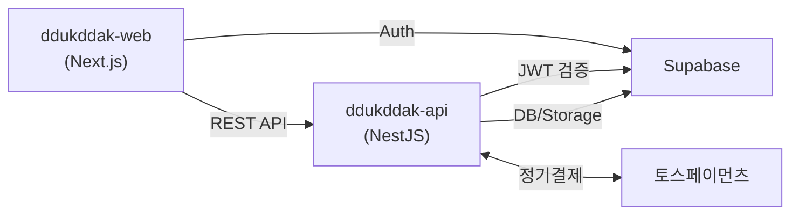

# 뚝딱동화 API (ddukddak-api)

> AI 동화 서비스 '뚝딱동화'의 백엔드 API 서버

## 프로젝트 소개

**뚝딱동화**는 AI로 생성된 동화를 어린이들에게 제공하는 서비스입니다. TTS 음성, 배경음악과 함께 한국어/영어 이중 언어를 지원하며, 부모와 아이가 함께 즐길 수 있는 동화 뷰어를 제공합니다.

### 주요 기능

- 동화 목록 및 상세 조회 (카테고리/연령별 필터)
- 동화 뷰어 (페이지 넘김, TTS, BGM)
- 읽기 진행률 저장 및 조회
- 구독 결제 (토스페이먼츠 정기결제)
- 사용자 프로필 관리

## 기술 스택

| 영역 | 기술 |
|------|------|
| Framework | NestJS 11.x (TypeScript) |
| Database | PostgreSQL (Supabase) |
| Auth | Supabase Auth (JWT) |
| Storage | Supabase Storage |
| 결제 | 토스페이먼츠 |
| 배포 | Google Cloud Run |

## 아키텍처



## 시작하기

### 사전 요구사항

- Node.js 20+
- pnpm

### 설치

```bash
# 의존성 설치
pnpm install

# 환경 변수 설정
cp .env.example .env
# .env 파일 수정

# 개발 서버 실행
pnpm run start:dev
```

### 환경 변수

```env
PORT=3000
NODE_ENV=development

# Supabase
SUPABASE_URL=https://xxx.supabase.co
SUPABASE_ANON_KEY=xxx
SUPABASE_SERVICE_ROLE_KEY=xxx

# 토스페이먼츠
TOSS_SECRET_KEY=test_sk_xxx
TOSS_WEBHOOK_SECRET=xxx

# CORS
CORS_ORIGIN=http://localhost:3000
```

## API 엔드포인트

| 메서드 | 엔드포인트 | 설명 |
|--------|-----------|------|
| GET | `/api/users/me` | 내 프로필 조회 |
| PATCH | `/api/users/me` | 프로필 수정 |
| DELETE | `/api/users/me` | 회원 탈퇴 |
| GET | `/api/stories` | 동화 목록 |
| GET | `/api/stories/:id` | 동화 상세 |
| GET | `/api/stories/:id/pages` | 동화 페이지 (뷰어) |
| GET | `/api/progress` | 진행률 목록 |
| GET/PUT | `/api/progress/:storyId` | 동화 진행률 |
| GET | `/api/subscriptions/plans` | 구독 플랜 |
| GET | `/api/subscriptions/me` | 내 구독 정보 |
| POST | `/api/subscriptions` | 구독 시작 |
| DELETE | `/api/subscriptions/me` | 구독 해지 |

## 스크립트

```bash
pnpm run start:dev    # 개발 서버
pnpm run build        # 빌드
pnpm run start:prod   # 프로덕션 실행
pnpm run lint         # 린트
pnpm run test         # 테스트
```

## 프로젝트 구조

```
src/
├── main.ts
├── app.module.ts
├── common/           # 공통 (Guards, Filters, Decorators)
├── config/           # 환경설정
├── supabase/         # Supabase 클라이언트
├── user/             # 사용자 모듈
├── story/            # 동화 모듈
├── progress/         # 진행률 모듈
├── subscription/     # 구독 모듈
└── webhook/          # 웹훅 모듈
```

## 관련 프로젝트

- [ddukddak-web](https://github.com/youngkim90/ddukddak-web) - 프론트엔드 (Next.js)

## 라이선스

Private
