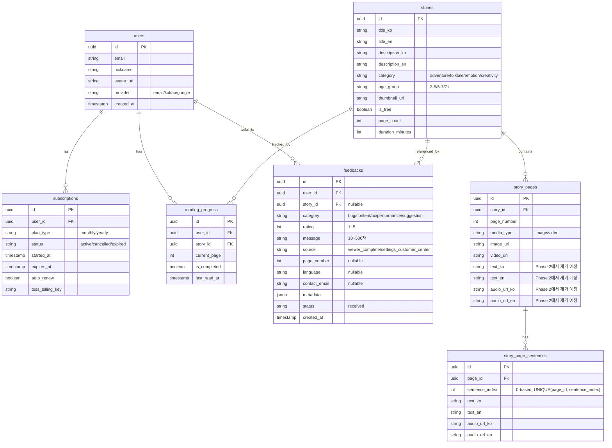

# DB ERD (Supabase PostgreSQL)

> 뚝딱동화 데이터베이스 스키마 및 테이블 관계도
> 마지막 업데이트: 2026-03-05

```mermaid
erDiagram
    users ||--o{ subscriptions : has
    users ||--o{ reading_progress : has
    users ||--o{ feedbacks : submits
    stories ||--o{ story_pages : contains
    story_pages ||--o{ story_page_sentences : has
    stories ||--o{ reading_progress : tracked_by
    stories ||--o{ feedbacks : referenced_by

    users {
        uuid id PK
        string email
        string nickname
        string avatar_url
        string provider "email/kakao/google"
        timestamp created_at
    }

    stories {
        uuid id PK
        string title_ko
        string title_en
        string description_ko
        string description_en
        string category "adventure/folktale/emotion/creativity"
        string age_group "3-5/5-7/7+"
        string thumbnail_url
        boolean is_free
        int page_count
        int duration_minutes
    }

    story_pages {
        uuid id PK
        uuid story_id FK
        int page_number
        string media_type "image/video"
        string image_url
        string video_url
        string text_ko "Phase 2에서 제거 예정"
        string text_en "Phase 2에서 제거 예정"
        string audio_url_ko "Phase 2에서 제거 예정"
        string audio_url_en "Phase 2에서 제거 예정"
    }

    story_page_sentences {
        uuid id PK
        uuid page_id FK
        int sentence_index "0-based, UNIQUE(page_id, sentence_index)"
        string text_ko
        string text_en
        string audio_url_ko
        string audio_url_en
    }

    subscriptions {
        uuid id PK
        uuid user_id FK
        string plan_type "monthly/yearly"
        string status "active/cancelled/expired"
        timestamp started_at
        timestamp expires_at
        boolean auto_renew
        string toss_billing_key
    }

    reading_progress {
        uuid id PK
        uuid user_id FK
        uuid story_id FK
        int current_page
        boolean is_completed
        timestamp last_read_at
    }

    feedbacks {
        uuid id PK
        uuid user_id FK
        uuid story_id FK "nullable"
        string category "bug/content/ux/performance/suggestion"
        int rating "1~5"
        string message "10~500자"
        string source "viewer_complete/settings_customer_center"
        int page_number "nullable"
        string language "nullable"
        string contact_email "nullable"
        jsonb metadata
        string status "received"
        timestamp created_at
    }
```
