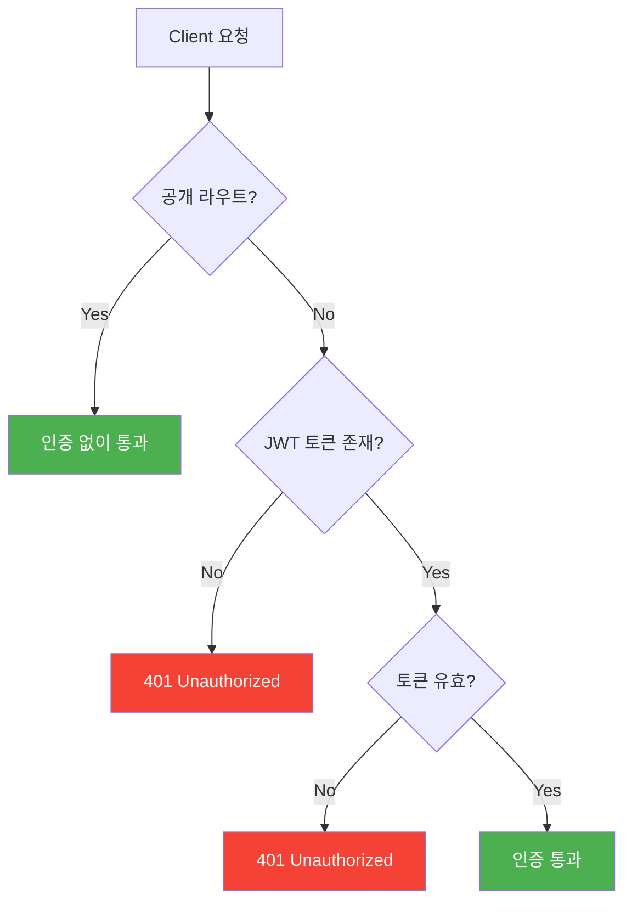
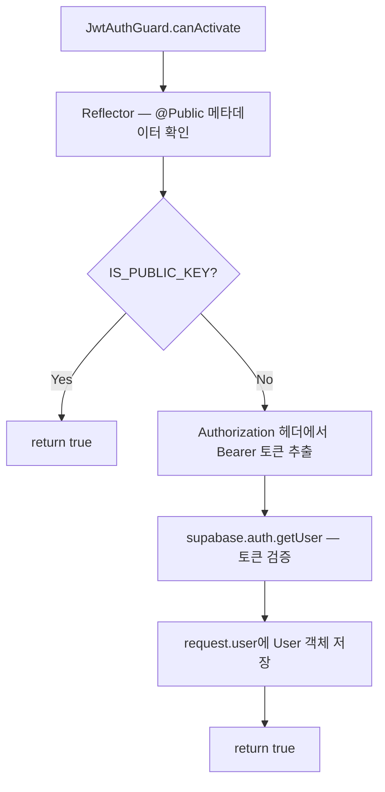
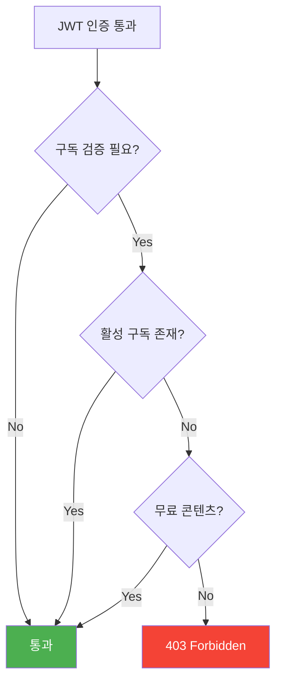
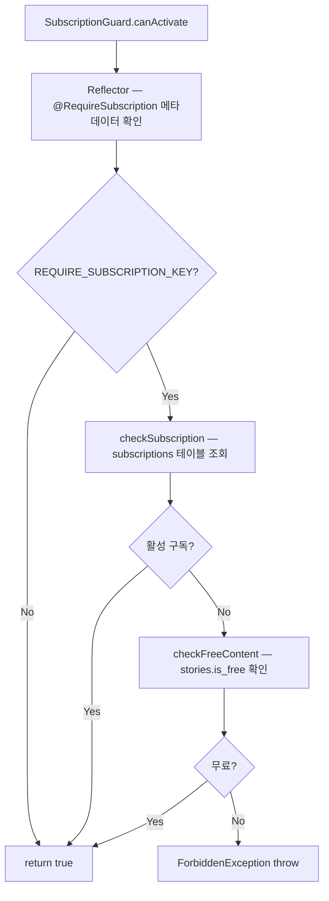
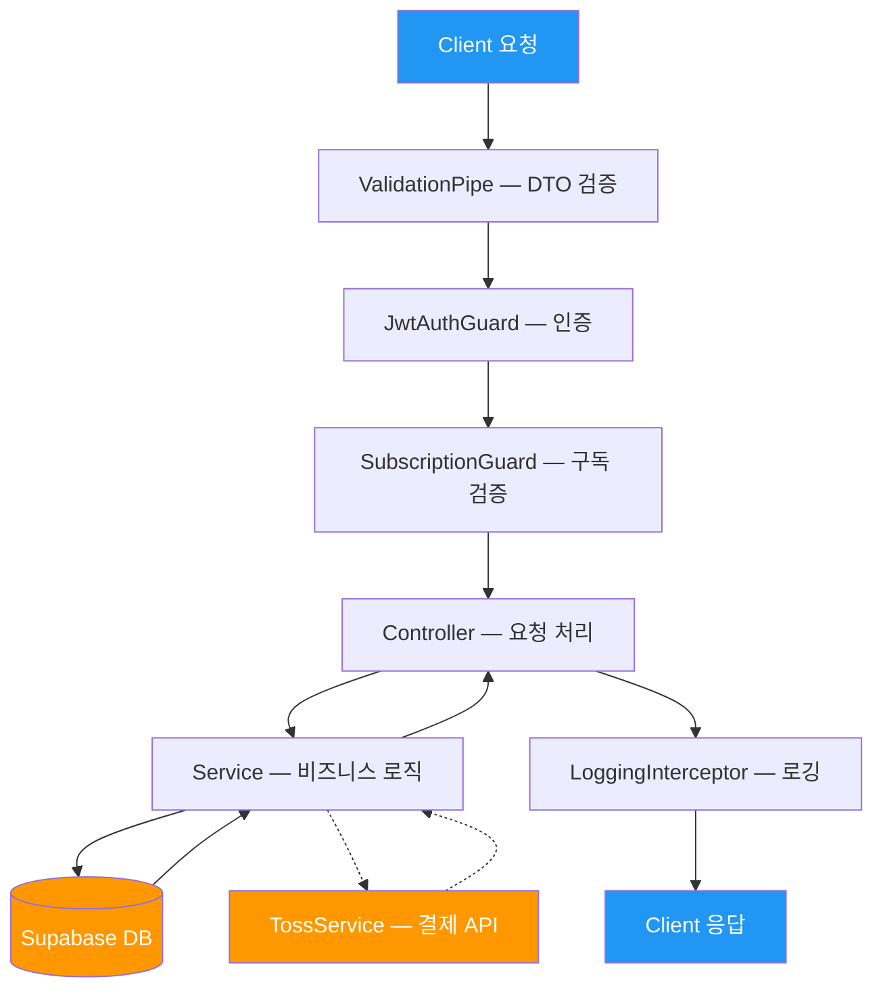

# 뚝딱동화 API 문서

> 전체 API 개요 및 공통 인증 흐름

---

## API 엔드포인트 목록

| 메서드 | 엔드포인트 | 설명 | 인증 | 문서 |
|--------|-----------|------|------|------|
| GET | `/api/health` | 헬스 체크 | 🔓 | - |
| GET | `/api/users/me` | 내 프로필 조회 | 🔒 | [user-api.md](./user-api.md) |
| PATCH | `/api/users/me` | 프로필 수정 | 🔒 | [user-api.md](./user-api.md) |
| DELETE | `/api/users/me` | 회원 탈퇴 | 🔒 | [user-api.md](./user-api.md) |
| GET | `/api/stories` | 동화 목록 조회 | 🔓 | [story-api.md](./story-api.md) |
| GET | `/api/stories/:id` | 동화 상세 조회 | 🔓 | [story-api.md](./story-api.md) |
| GET | `/api/stories/:id/pages` | 동화 페이지 조회 | 💎 | [story-api.md](./story-api.md) |
| GET | `/api/progress` | 내 진행률 목록 | 🔒 | [progress-api.md](./progress-api.md) |
| GET | `/api/progress/:storyId` | 특정 동화 진행률 | 🔒 | [progress-api.md](./progress-api.md) |
| PUT | `/api/progress/:storyId` | 진행률 저장 | 🔒 | [progress-api.md](./progress-api.md) |
| GET | `/api/subscriptions/plans` | 구독 플랜 목록 | 🔓 | [subscription-api.md](./subscription-api.md) |
| GET | `/api/subscriptions/me` | 내 구독 정보 | 🔒 | [subscription-api.md](./subscription-api.md) |
| POST | `/api/subscriptions` | 구독 시작 | 🔒 | [subscription-api.md](./subscription-api.md) |
| DELETE | `/api/subscriptions/me` | 구독 해지 | 🔒 | [subscription-api.md](./subscription-api.md) |
| POST | `/api/webhooks/toss` | 토스페이먼츠 웹훅 | 🔐 | [webhook-api.md](./webhook-api.md) |

**인증 구분**: 🔓 공개 | 🔒 로그인 필요 | 💎 구독 필요 | 🔐 내부용 (시크릿 키)

---

## 공통 인증 흐름 — JwtAuthGuard

모든 요청은 전역 `JwtAuthGuard`를 거칩니다. `@Public()` 데코레이터가 적용된 라우트는 검증을 건너뜁니다.

### API 흐름



### 코드 흐름



---

## 구독 검증 흐름 — SubscriptionGuard

`JwtAuthGuard` 통과 후, `@RequireSubscription()` 데코레이터가 적용된 라우트에서 추가로 구독 상태를 검증합니다.

### API 흐름



### 코드 흐름



---

## 전체 요청 처리 파이프라인



---

## 공통 에러 응답 형식

`HttpExceptionFilter`가 모든 에러를 표준화된 형식으로 변환합니다.

```json
{
  "statusCode": 401,
  "message": "Invalid or expired token",
  "timestamp": "2026-01-31T12:00:00.000Z",
  "path": "/api/users/me"
}
```

---

## Supabase 클라이언트 사용 구분

| 클라이언트 | 사용처 | 특징 |
|-----------|--------|------|
| **Public Client** | 동화 목록/상세 조회 | RLS 정책 적용 |
| **Admin Client** | 사용자, 진행률, 구독 관리 | RLS 우회, 백엔드 전용 |
