```mermaid
flowchart TD
    A[Client] -->|"PUT /api/progress/:storyId<br/>Authorization: Bearer token<br/>Body: UpdateProgressDto"| B[JwtAuthGuard]
    B --> C["ValidationPipe<br/>currentPage, isCompleted 검증"]
    C --> D[ProgressController.upsert]
    D --> E[ProgressService.upsert]
    E --> F["1. 동화 존재 확인<br/>SELECT id, title_ko, page_count<br/>FROM stories WHERE id = :storyId"]
    F --> G{동화 존재?}
    G -- No --> H["404 Not Found"]
    G -- Yes --> I["2. Admin Client<br/>UPSERT INTO reading_progress<br/>(user_id, story_id, current_page,<br/>is_completed, last_read_at)<br/>ON CONFLICT (user_id, story_id)<br/>DO UPDATE"]
    I --> J{Supabase 에러?}
    J -- Yes --> K["500 Internal Server Error"]
    J -- No --> L["200 OK<br/>ProgressResponseDto"]

    style A fill:#2196f3,color:#fff
    style H fill:#f44336,color:#fff
    style K fill:#f44336,color:#fff
    style L fill:#4caf50,color:#fff
```

# 진행률 API (Progress)

> `src/progress/` — 읽기 진행률 목록, 조회, 저장

---

## 엔드포인트 요약

| 메서드 | 경로 | 설명 | 인증 |
|--------|------|------|------|
| GET | `/api/progress` | 내 진행률 목록 | 🔒 |
| GET | `/api/progress/:storyId` | 특정 동화 진행률 | 🔒 |
| PUT | `/api/progress/:storyId` | 진행률 저장 (upsert) | 🔒 |

---

## GET /api/progress — 전체 진행률 목록

사용자의 모든 읽기 진행률을 `stories` 테이블과 JOIN하여 동화 제목, 전체 페이지 수와 함께 반환합니다.

### Flowchart


### 요청

- **Headers**: `Authorization: Bearer <token>`
- **Parameters**: 없음
- **Body**: 없음

### 응답

```json
{
  "data": [
    {
      "storyId": "uuid",
      "storyTitle": "토끼와 거북이",
      "currentPage": 5,
      "totalPages": 12,
      "isCompleted": false,
      "lastReadAt": "2026-01-30T15:30:00.000Z"
    }
  ]
}
```

---

## GET /api/progress/:storyId — 특정 동화 진행률

특정 동화에 대한 진행률을 조회합니다.

### Flowchart


### 요청

- **Headers**: `Authorization: Bearer <token>`
- **Parameters**: `storyId` (UUID, path parameter)
- **Body**: 없음

### 응답

```json
{
  "storyId": "uuid",
  "storyTitle": "토끼와 거북이",
  "currentPage": 5,
  "totalPages": 12,
  "isCompleted": false,
  "lastReadAt": "2026-01-30T15:30:00.000Z"
}
```

---

## PUT /api/progress/:storyId — 진행률 저장

진행률을 저장합니다. `(user_id, story_id)` 유니크 제약조건에 의해, 기존 레코드가 있으면 업데이트하고 없으면 새로 생성합니다 (upsert).

### Flowchart



### 요청

- **Headers**: `Authorization: Bearer <token>`
- **Parameters**: `storyId` (UUID, path parameter)
- **Body**:

```json
{
  "currentPage": 5,
  "isCompleted": false
}
```

| 필드 | 타입 | 필수 | 설명 |
|------|------|------|------|
| `currentPage` | number | ✅ | 최소 1, 정수 |
| `isCompleted` | boolean | - | 기본값 false |

### 응답

```json
{
  "storyId": "uuid",
  "storyTitle": "토끼와 거북이",
  "currentPage": 5,
  "totalPages": 12,
  "isCompleted": false,
  "lastReadAt": "2026-01-30T15:30:00.000Z"
}
```

---

## 관련 DB 테이블

```sql
reading_progress
├── id            UUID    PK
├── user_id       UUID    FK → users.id
├── story_id      UUID    FK → stories.id
├── current_page  INT
├── is_completed  BOOLEAN
├── last_read_at  TIMESTAMPTZ
└── UNIQUE(user_id, story_id)
```
