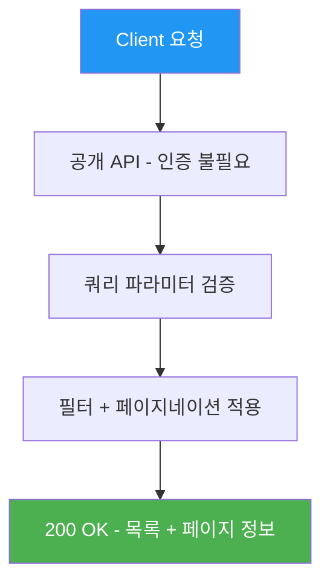
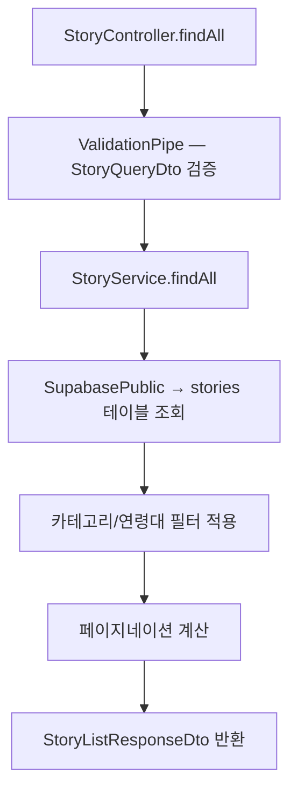
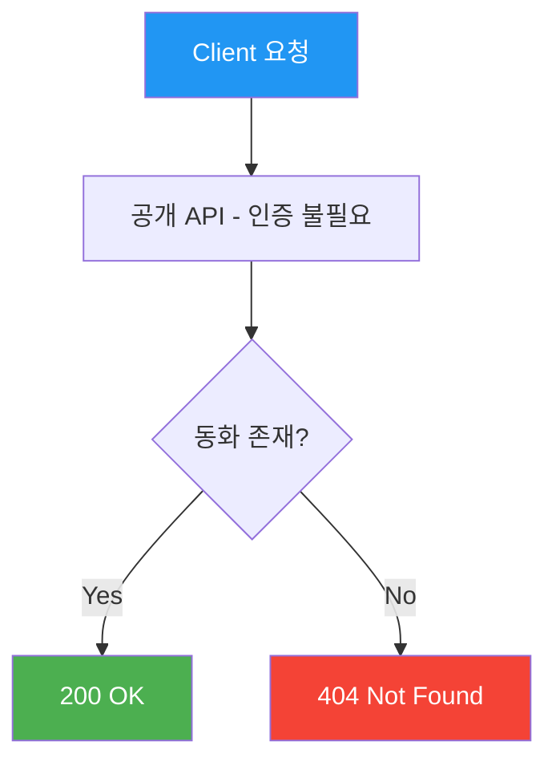
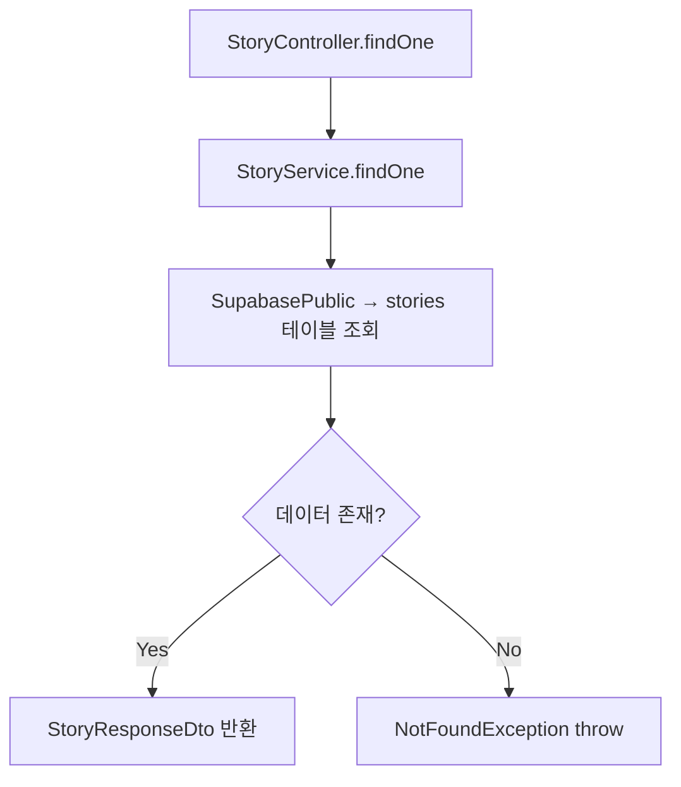
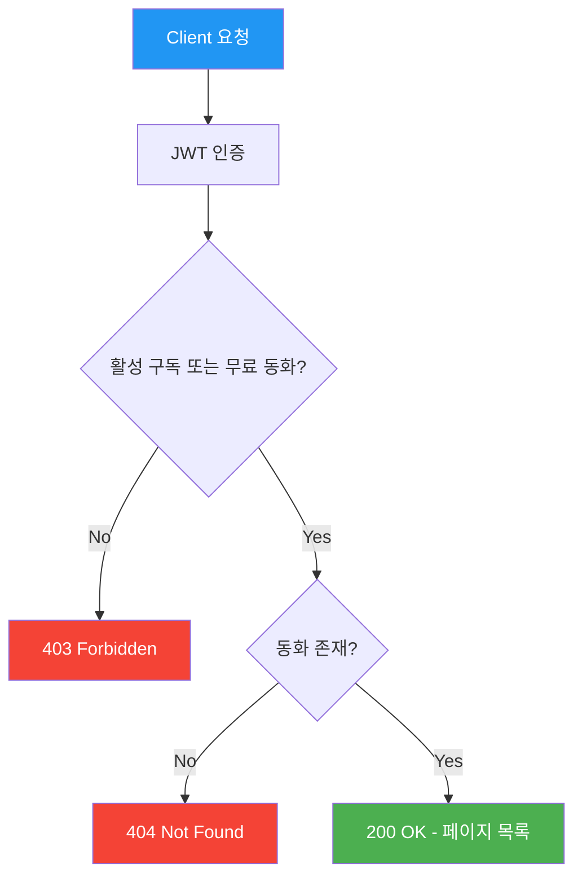
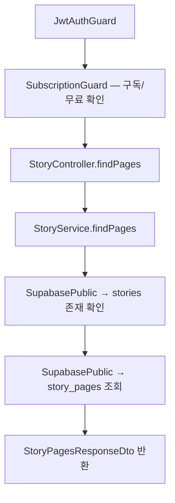

# 동화 API (Story)

> `src/story/` — 동화 목록, 상세, 페이지 조회

---

## 엔드포인트 요약

| 메서드 | 경로 | 설명 | 인증 |
|--------|------|------|------|
| GET | `/api/stories` | 동화 목록 (필터, 페이지네이션) | 🔓 |
| GET | `/api/stories/:id` | 동화 상세 | 🔓 |
| GET | `/api/stories/:id/pages` | 동화 페이지 (뷰어용) | 💎 |

---

## GET /api/stories — 동화 목록 조회

카테고리, 연령대 필터와 페이지네이션을 지원합니다.

### API 흐름



### 코드 흐름



### 요청

- **Headers**: 없음 (공개 API)
- **Parameters**:

| 파라미터 | 타입 | 필수 | 기본값 | 설명 |
|---------|------|------|--------|------|
| `category` | enum | - | - | `folktale`, `lesson`, `family`, `adventure`, `creativity` |
| `ageGroup` | enum | - | - | `3-5`, `5-7`, `7+` |
| `page` | number | - | 1 | 최소 1 |
| `limit` | number | - | 10 | 최소 1, 최대 50 |

- **Body**: 없음

### 응답

```json
{
  "stories": [
    {
      "id": "uuid",
      "titleKo": "토끼와 거북이",
      "titleEn": "The Tortoise and the Hare",
      "descriptionKo": "...",
      "descriptionEn": "...",
      "thumbnailUrl": "https://...",
      "category": "lesson",
      "ageGroup": "3-5",
      "pageCount": 12,
      "durationMinutes": 5,
      "isFree": true
    }
  ],
  "pagination": {
    "page": 1,
    "limit": 10,
    "total": 25,
    "totalPages": 3,
    "hasNext": true,
    "hasPrev": false
  }
}
```

---

## GET /api/stories/:id — 동화 상세 조회

단일 동화의 상세 정보를 조회합니다.

### API 흐름



### 코드 흐름



### 요청

- **Headers**: 없음 (공개 API)
- **Parameters**: `id` (UUID, path parameter)
- **Body**: 없음

### 응답

```json
{
  "id": "uuid",
  "titleKo": "토끼와 거북이",
  "titleEn": "The Tortoise and the Hare",
  "descriptionKo": "...",
  "descriptionEn": "...",
  "thumbnailUrl": "https://...",
  "category": "lesson",
  "ageGroup": "3-5",
  "pageCount": 12,
  "durationMinutes": 5,
  "isFree": true,
  "createdAt": "2026-01-01T00:00:00.000Z"
}
```

---

## GET /api/stories/:id/pages — 동화 페이지 조회

동화 뷰어용 페이지 데이터를 조회합니다. JWT 인증과 구독 검증이 필요하며, 무료 동화는 구독 없이도 접근 가능합니다.

### API 흐름



### 코드 흐름



### 요청

- **Headers**: `Authorization: Bearer <token>`
- **Parameters**: `id` (UUID, path parameter)
- **Body**: 없음

### 응답

```json
{
  "storyId": "uuid",
  "pages": [
    {
      "id": "uuid",
      "pageNumber": 1,
      "imageUrl": "https://...",
      "textKo": "옛날 옛적에...",
      "textEn": "Once upon a time...",
      "mediaType": "image",
      "videoUrl": null,
      "audioUrlKo": "https://...",
      "audioUrlEn": "https://..."
    }
  ]
}
```

---

## 관련 DB 테이블

```sql
stories
├── id                UUID    PK
├── title_ko          TEXT
├── title_en          TEXT
├── description_ko    TEXT
├── description_en    TEXT
├── category          TEXT    -- 'folktale' | 'lesson' | 'family' | 'adventure' | 'creativity'
├── age_group         TEXT    -- '3-5' | '5-7' | '7+'
├── thumbnail_url     TEXT
├── is_free           BOOLEAN -- default false
├── page_count        INT
├── duration_minutes  INT
├── bgm_url           TEXT
└── created_at        TIMESTAMPTZ

story_pages
├── id            UUID    PK
├── story_id      UUID    FK → stories.id
├── page_number   INT
├── media_type    TEXT    -- 'image' | 'video' (DEFAULT 'image')
├── image_url     TEXT
├── video_url     TEXT    -- AI 영상 MP4 URL (nullable)
├── text_ko       TEXT
├── text_en       TEXT
├── audio_url_ko  TEXT
└── audio_url_en  TEXT
```
