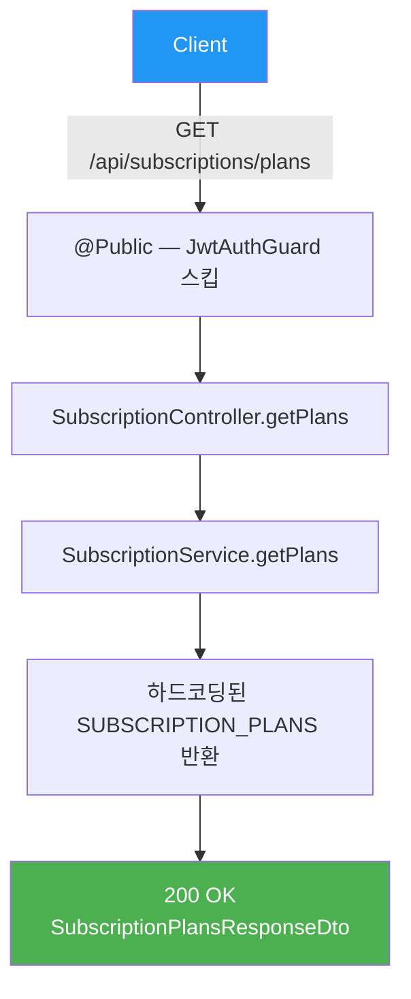
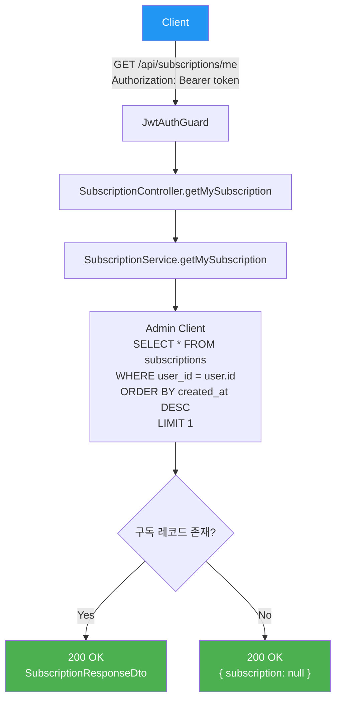
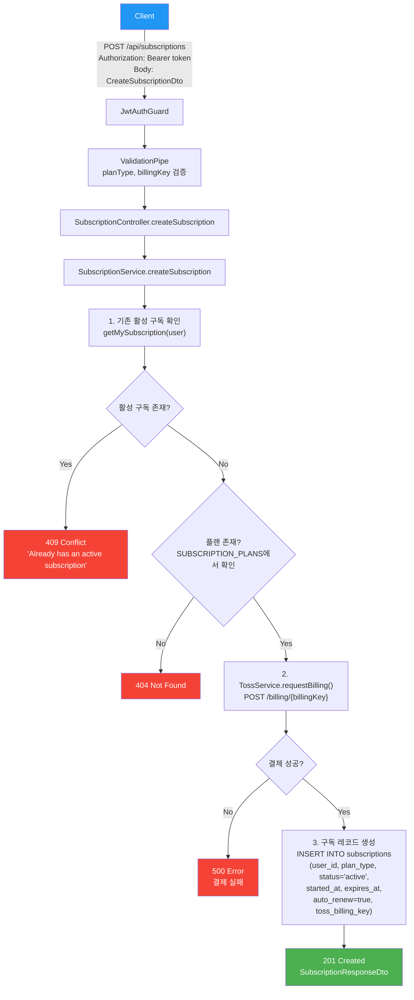
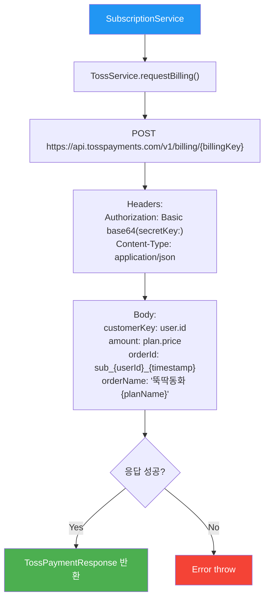
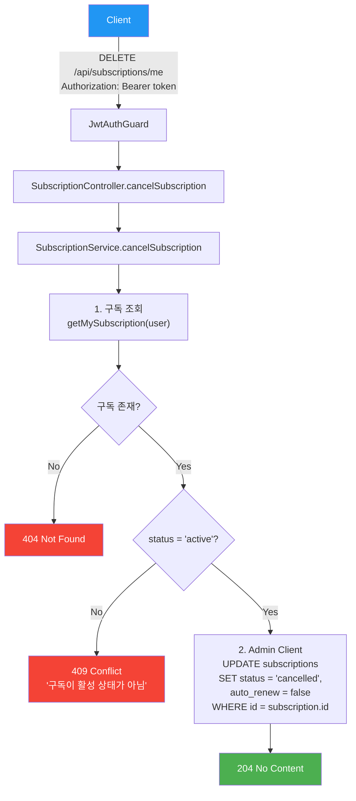
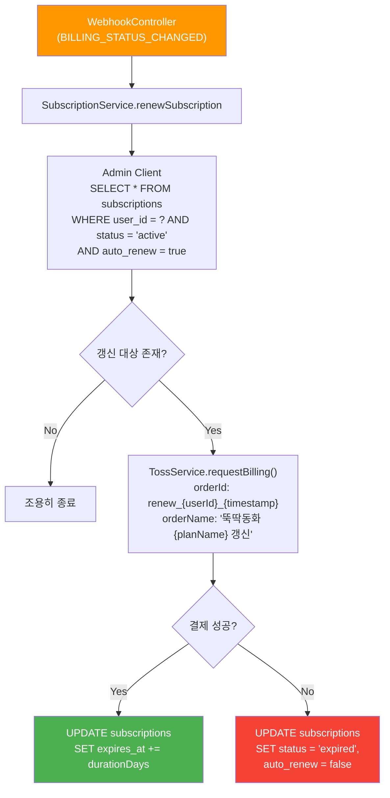

# 구독 API (Subscription)

> `src/subscription/` — 구독 플랜, 구독 관리, 토스페이먼츠 결제

---

## 엔드포인트 요약

| 메서드 | 경로 | 설명 | 인증 |
|--------|------|------|------|
| GET | `/api/subscriptions/plans` | 구독 플랜 목록 | 🔓 |
| GET | `/api/subscriptions/me` | 내 구독 정보 | 🔒 |
| POST | `/api/subscriptions` | 구독 시작 (결제) | 🔒 |
| DELETE | `/api/subscriptions/me` | 구독 해지 | 🔒 |

---

## GET /api/subscriptions/plans — 구독 플랜 목록

하드코딩된 구독 플랜 정보를 반환합니다.

### Flowchart



### 요청

- **Headers**: 없음 (공개 API)
- **Parameters**: 없음
- **Body**: 없음

### 응답

```json
{
  "plans": [
    {
      "id": "monthly",
      "name": "월간 구독",
      "price": 4900,
      "period": "monthly",
      "features": ["모든 동화 무제한", "오프라인 저장"]
    },
    {
      "id": "yearly",
      "name": "연간 구독",
      "price": 39000,
      "period": "yearly",
      "features": ["모든 동화 무제한", "오프라인 저장", "2개월 무료"]
    }
  ]
}
```

---

## GET /api/subscriptions/me — 내 구독 정보

현재 사용자의 가장 최근 구독 정보를 조회합니다.

### Flowchart



### 요청

- **Headers**: `Authorization: Bearer <token>`
- **Parameters**: 없음
- **Body**: 없음

### 응답

```json
{
  "id": "uuid",
  "planType": "monthly",
  "status": "active",
  "startedAt": "2026-01-01T00:00:00.000Z",
  "expiresAt": "2026-01-31T00:00:00.000Z",
  "autoRenew": true
}
```

---

## POST /api/subscriptions — 구독 시작

빌링키로 토스페이먼츠 결제를 진행하고, 구독 레코드를 생성합니다.

### Flowchart



### 요청

- **Headers**: `Authorization: Bearer <token>`
- **Parameters**: 없음
- **Body**:

```json
{
  "planType": "monthly",
  "billingKey": "billing_key_from_toss"
}
```

| 필드 | 타입 | 필수 | 설명 |
|------|------|------|------|
| `planType` | enum | ✅ | `monthly` 또는 `yearly` |
| `billingKey` | string | ✅ | 토스페이먼츠 빌링키 |

### 응답

```json
{
  "id": "uuid",
  "planType": "monthly",
  "status": "active",
  "startedAt": "2026-01-31T00:00:00.000Z",
  "expiresAt": "2026-03-02T00:00:00.000Z",
  "autoRenew": true
}
```

### 토스페이먼츠 결제 요청 상세



---

## DELETE /api/subscriptions/me — 구독 해지

활성 구독의 상태를 `cancelled`로 변경하고 자동 갱신을 비활성화합니다. 구독은 만료일까지 유지됩니다.

### Flowchart



### 요청

- **Headers**: `Authorization: Bearer <token>`
- **Parameters**: 없음
- **Body**: 없음

### 응답

- **204 No Content** (성공 시 Body 없음)

---

## 구독 자동 갱신 흐름 (내부)

웹훅에서 호출되는 자동 갱신 로직입니다. 직접 API로 노출되지 않습니다.



---

## 관련 DB 테이블

```sql
subscriptions
├── id                UUID    PK
├── user_id           UUID    FK → users.id
├── plan_type         TEXT    -- 'monthly' | 'yearly'
├── status            TEXT    -- 'active' | 'cancelled' | 'expired'
├── started_at        TIMESTAMPTZ
├── expires_at        TIMESTAMPTZ
├── auto_renew        BOOLEAN
├── toss_billing_key  TEXT
└── created_at        TIMESTAMPTZ
```
