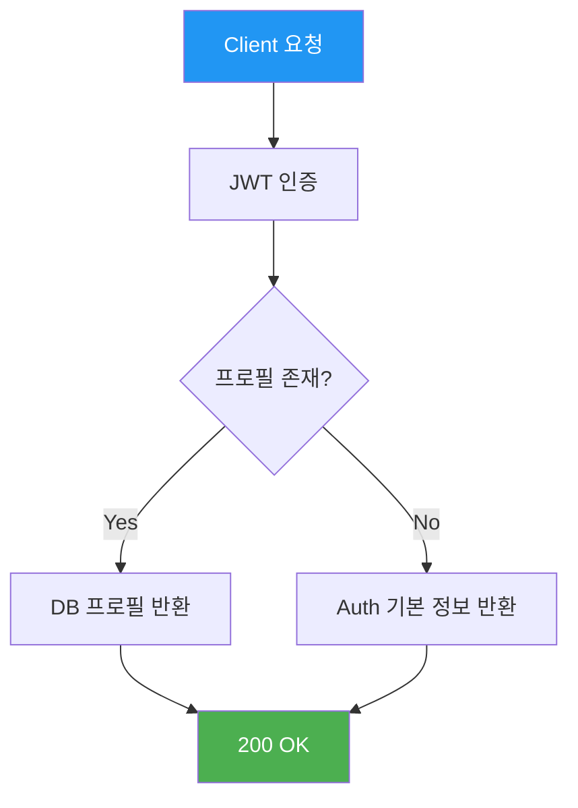
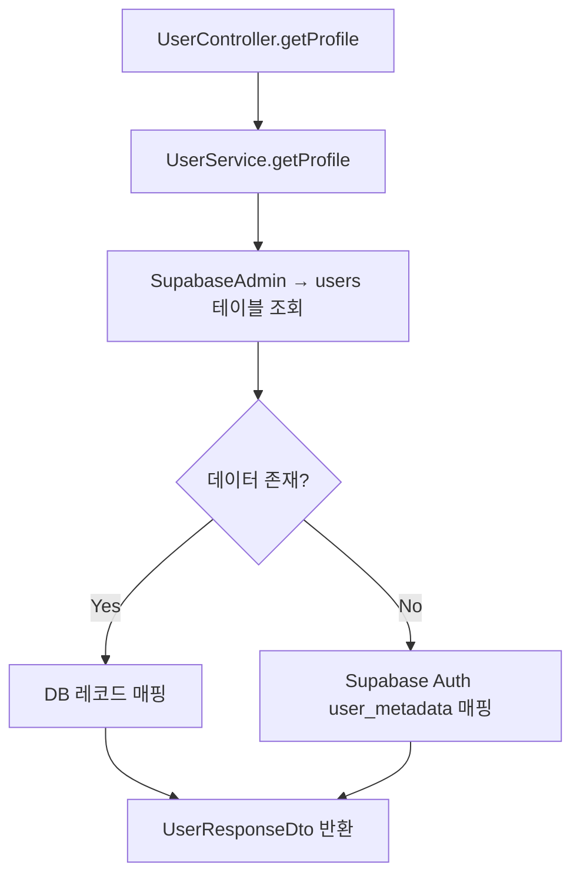
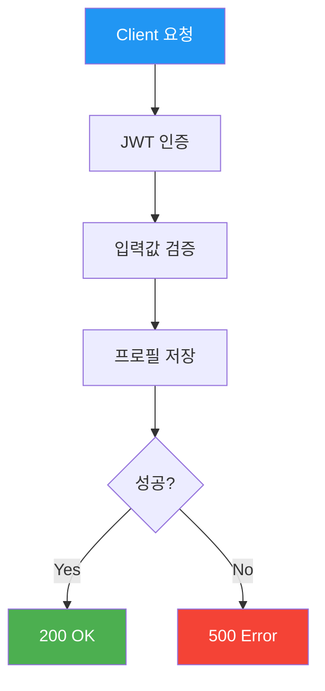
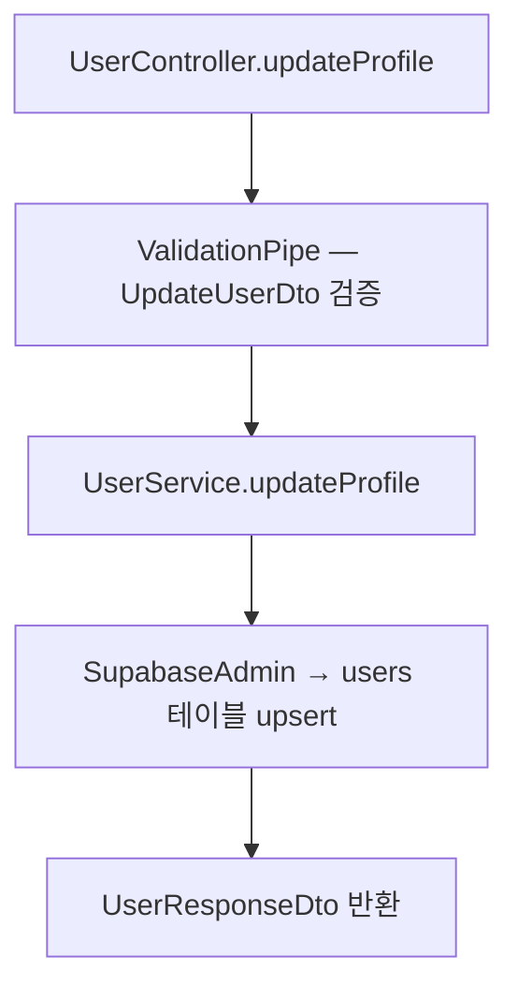
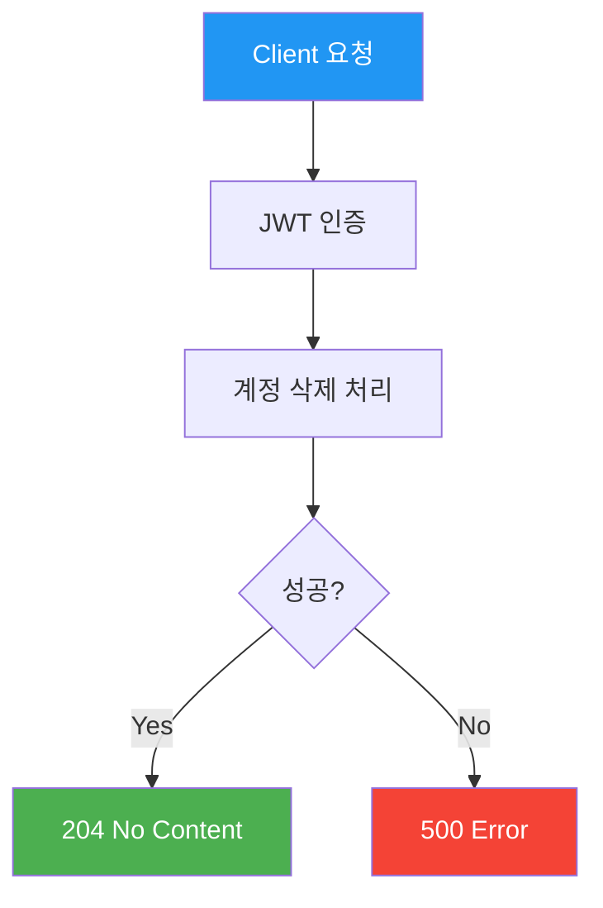
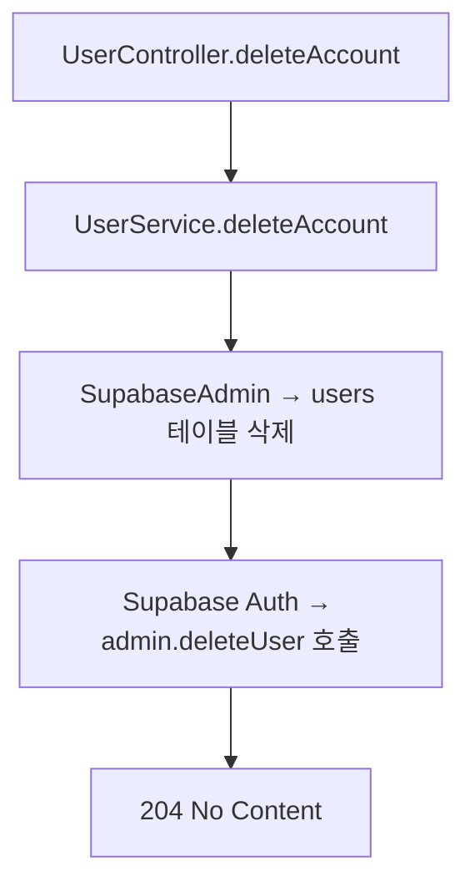

# 사용자 API (User)

> `src/user/` — 프로필 조회, 수정, 회원 탈퇴

---

## 엔드포인트 요약

| 메서드 | 경로 | 설명 | 인증 |
|--------|------|------|------|
| GET | `/api/users/me` | 내 프로필 조회 | 🔒 |
| PATCH | `/api/users/me` | 프로필 수정 | 🔒 |
| DELETE | `/api/users/me` | 회원 탈퇴 | 🔒 |

---

## GET /api/users/me — 프로필 조회

JWT 인증 사용자의 프로필을 조회합니다. `users` 테이블에 레코드가 없으면 Supabase Auth 메타데이터에서 기본 정보를 반환합니다.

### API 흐름



### 코드 흐름



### 요청

- **Headers**: `Authorization: Bearer <token>`
- **Parameters**: 없음
- **Body**: 없음

### 응답

```json
{
  "id": "uuid",
  "email": "user@example.com",
  "nickname": "홍길동",
  "avatarUrl": "https://...",
  "provider": "kakao",
  "createdAt": "2026-01-01T00:00:00.000Z"
}
```

---

## PATCH /api/users/me — 프로필 수정

프로필 정보를 수정합니다. `users` 테이블에 레코드가 없으면 자동으로 생성됩니다 (upsert).

### API 흐름



### 코드 흐름



### 요청

- **Headers**: `Authorization: Bearer <token>`
- **Parameters**: 없음
- **Body**:

```json
{
  "nickname": "새닉네임",
  "avatarUrl": "https://..."
}
```

| 필드 | 타입 | 필수 | 설명 |
|------|------|------|------|
| `nickname` | string | - | 최대 50자 |
| `avatarUrl` | string | - | URL 형식 |

### 응답

```json
{
  "id": "uuid",
  "email": "user@example.com",
  "nickname": "새닉네임",
  "avatarUrl": "https://...",
  "provider": "kakao",
  "createdAt": "2026-01-01T00:00:00.000Z"
}
```

---

## DELETE /api/users/me — 회원 탈퇴

`users` 테이블 레코드 삭제 후, Supabase Auth에서도 사용자를 삭제합니다.

### API 흐름



### 코드 흐름



### 요청

- **Headers**: `Authorization: Bearer <token>`
- **Parameters**: 없음
- **Body**: 없음

### 응답

- **204 No Content** (성공 시 Body 없음)

---

## 관련 DB 테이블

```sql
users
├── id          UUID    PK   -- Supabase Auth UID와 동일
├── email       TEXT
├── nickname    TEXT         -- nullable
├── avatar_url  TEXT         -- nullable
├── provider    TEXT         -- 'email' | 'kakao' | 'google'
└── created_at  TIMESTAMPTZ
```
