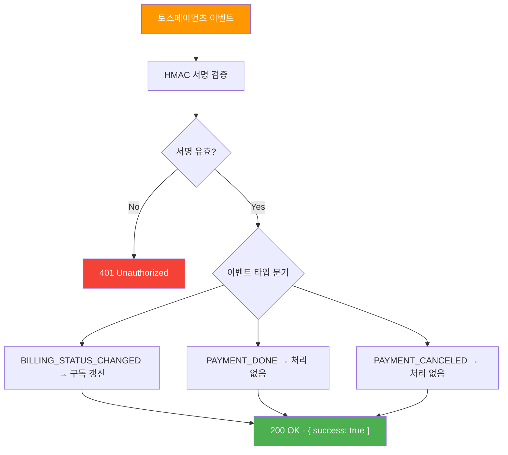
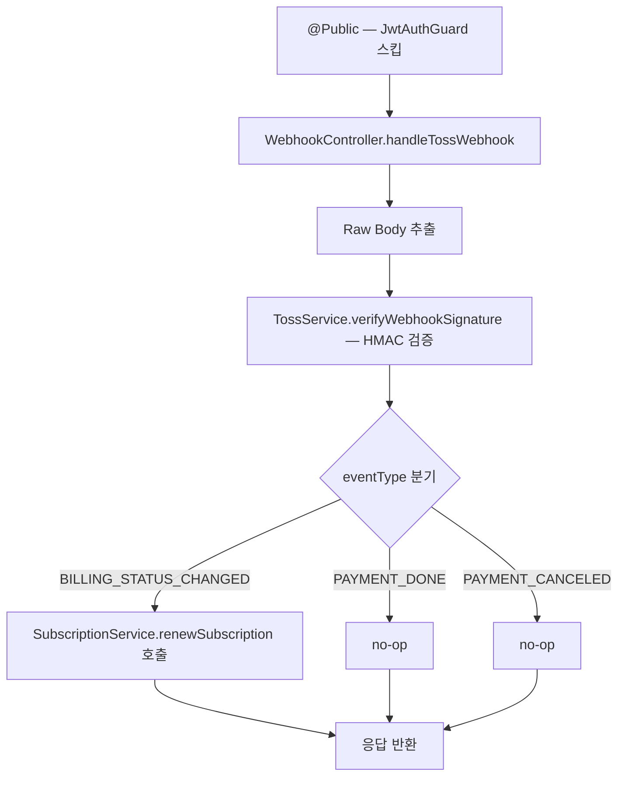
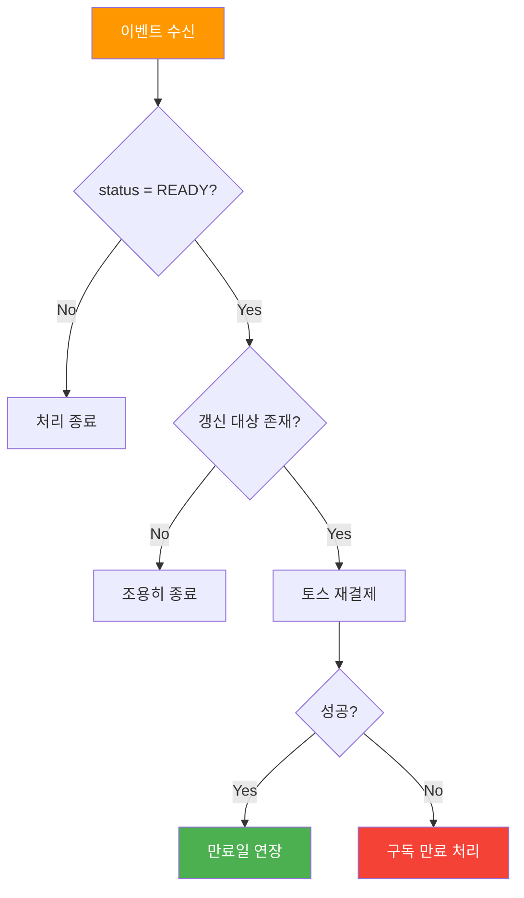
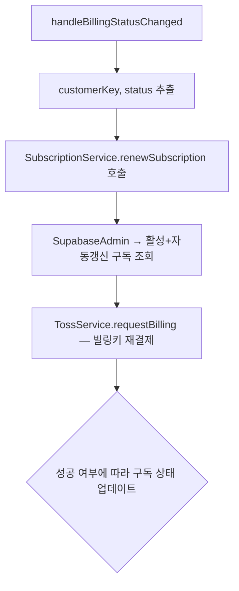

# 웹훅 API (Webhook)

> `src/webhook/` — 토스페이먼츠 웹훅 처리

---

## 엔드포인트 요약

| 메서드 | 경로 | 설명 | 인증 |
|--------|------|------|------|
| POST | `/api/webhooks/toss` | 토스페이먼츠 웹훅 | 🔐 HMAC 서명 |

---

## POST /api/webhooks/toss — 토스 웹훅 처리

토스페이먼츠에서 결제/빌링 이벤트 발생 시 호출됩니다. HMAC-SHA256 서명으로 요청을 검증합니다.

### API 흐름



### 코드 흐름



### 요청

- **Headers**: `toss-signature` (HMAC-SHA256 서명값)
- **Parameters**: 없음
- **Body**:

```json
{
  "eventType": "BILLING_STATUS_CHANGED",
  "createdAt": "2026-01-31T00:00:00.000Z",
  "data": {
    "paymentKey": "payment_key",
    "orderId": "order_id",
    "status": "READY",
    "customerKey": "user_uuid",
    "billingKey": "billing_key"
  }
}
```

| 필드 | 타입 | 설명 |
|------|------|------|
| `eventType` | string | `BILLING_STATUS_CHANGED`, `PAYMENT_DONE`, `PAYMENT_CANCELED` |
| `createdAt` | string | ISO timestamp |
| `data.paymentKey` | string | 결제 키 |
| `data.orderId` | string | 주문 ID |
| `data.status` | string | 상태 |
| `data.customerKey` | string | 고객 키 (= user.id) |
| `data.billingKey` | string | 빌링 키 |

### 응답

```json
{
  "success": true
}
```

---

## BILLING_STATUS_CHANGED 이벤트 처리

빌링 상태가 변경되면 구독 자동 갱신을 시도합니다.

### API 흐름



### 코드 흐름



---

## 보안 참고사항

- `@Public()` 데코레이터로 JWT 검증을 건너뛰지만, HMAC 서명으로 별도 인증합니다
- `rawBody: true` 옵션이 `main.ts`에서 활성화되어 원본 body로 서명 검증합니다
- `TOSS_WEBHOOK_SECRET` 환경 변수가 서명 검증 키로 사용됩니다
