```mermaid
flowchart TD
    A["토스페이먼츠<br/>이벤트 발생"] -->|"POST /api/webhooks/toss<br/>toss-signature 헤더"| B["@Public — JwtAuthGuard 스킵"]
    B --> C[WebhookController.handleTossWebhook]
    C --> D["1. Raw Body 추출"]
    D --> E["2. HMAC-SHA256 서명 검증<br/>tossService.verifyWebhookSignature<br/>(rawBody, signature, webhookSecret)"]
    E --> F{서명 유효?}
    F -- No --> G["401 Unauthorized<br/>'Invalid webhook signature'"]
    F -- Yes --> H{"3. eventType 분기"}
    H -->|BILLING_STATUS_CHANGED| I[handleBillingStatusChanged]
    H -->|PAYMENT_DONE| J["handlePaymentDone<br/>(현재 no-op)"]
    H -->|PAYMENT_CANCELED| K["handlePaymentCanceled<br/>(현재 no-op)"]
    H -->|기타| L[무시]
    I --> M["200 OK<br/>{ success: true }"]
    J --> M
    K --> M
    L --> M

    style A fill:#ff9800,color:#fff
    style G fill:#f44336,color:#fff
    style M fill:#4caf50,color:#fff
```

```mermaid
flowchart TD
    A["BILLING_STATUS_CHANGED<br/>이벤트 수신"] --> B["payload.data에서<br/>customerKey, status 추출"]
    B --> C{status = 'READY'?}
    C -- No --> D[처리 종료]
    C -- Yes --> E["subscriptionService<br/>.renewSubscription(customerKey)"]
    E --> F["활성 + 자동갱신 구독 조회<br/>WHERE user_id = customerKey<br/>AND status = 'active'<br/>AND auto_renew = true"]
    F --> G{구독 존재?}
    G -- No --> H[조용히 종료]
    G -- Yes --> I["TossService.requestBilling()<br/>빌링키로 재결제"]
    I --> J{결제 성공?}
    J -- Yes --> K["구독 갱신<br/>expires_at += durationDays"]
    J -- No --> L["구독 만료 처리<br/>status = 'expired'<br/>auto_renew = false"]

    style A fill:#ff9800,color:#fff
    style K fill:#4caf50,color:#fff
    style L fill:#f44336,color:#fff
```

# 웹훅 API (Webhook)

> `src/webhook/` — 토스페이먼츠 웹훅 처리

---

## 엔드포인트 요약

| 메서드 | 경로 | 설명 | 인증 |
|--------|------|------|------|
| POST | `/api/webhooks/toss` | 토스페이먼츠 웹훅 | 🔐 HMAC 서명 |

---

## POST /api/webhooks/toss — 토스 웹훅 처리

토스페이먼츠에서 결제/빌링 이벤트 발생 시 호출됩니다. HMAC-SHA256 서명으로 요청을 검증합니다.

### Flowchart



### 요청

- **Headers**: `toss-signature` (HMAC-SHA256 서명값)
- **Parameters**: 없음
- **Body**:

```json
{
  "eventType": "BILLING_STATUS_CHANGED",
  "createdAt": "2026-01-31T00:00:00.000Z",
  "data": {
    "paymentKey": "payment_key",
    "orderId": "order_id",
    "status": "READY",
    "customerKey": "user_uuid",
    "billingKey": "billing_key"
  }
}
```

| 필드 | 타입 | 설명 |
|------|------|------|
| `eventType` | string | `BILLING_STATUS_CHANGED`, `PAYMENT_DONE`, `PAYMENT_CANCELED` |
| `createdAt` | string | ISO timestamp |
| `data.paymentKey` | string | 결제 키 |
| `data.orderId` | string | 주문 ID |
| `data.status` | string | 상태 |
| `data.customerKey` | string | 고객 키 (= user.id) |
| `data.billingKey` | string | 빌링 키 |

### 응답

```json
{
  "success": true
}
```

---

## 서명 검증 상세

```mermaid
flowchart TD
    A["toss-signature 헤더에서<br/>서명값 추출"] --> B["HMAC-SHA256 계산<br/>key: TOSS_WEBHOOK_SECRET<br/>data: Raw Request Body"]
    B --> C["base64 인코딩"]
    C --> D{계산된 서명 === 전달된 서명?}
    D -- Yes --> E[검증 성공]
    D -- No --> F[검증 실패]

    style E fill:#4caf50,color:#fff
    style F fill:#f44336,color:#fff
```



---

## BILLING_STATUS_CHANGED 이벤트 처리

빌링 상태가 변경되면 구독 자동 갱신을 시도합니다.

### Flowchart



### 요청

- 이 흐름은 웹훅 내부에서 자동으로 실행됩니다 (별도 API 아님)

### 응답

- 웹훅 전체 응답에 포함: `{ "success": true }`

---

## 보안 참고사항

- `@Public()` 데코레이터로 JWT 검증을 건너뛰지만, HMAC 서명으로 별도 인증합니다
- `rawBody: true` 옵션이 `main.ts`에서 활성화되어 있어 서명 검증에 원본 body를 사용합니다
- `TOSS_WEBHOOK_SECRET` 환경 변수가 서명 검증 키로 사용됩니다
